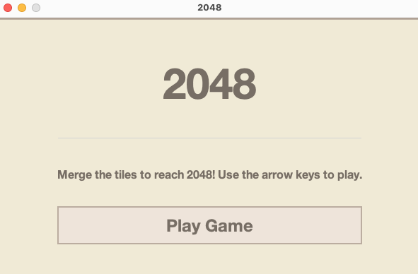
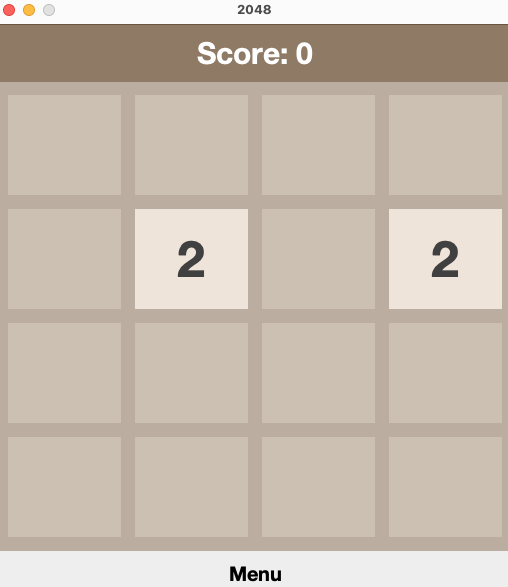

# 2048 Game - Java GUI Implementation

This project is a Java-based implementation of the popular 2048 puzzle game, developed as part of a software development course. It follows the Model-View-Controller (MVC) design pattern, ensuring a clean, modular structure that enhances code readability and simplifies future extensions.

---

## Compiling and Execution

1. Open your terminal or IDE.
2. Run the Game:
   - Using the command line:
     ```bash
     make demo
     ```

## Demo Images

Here are some screenshots of the game in action:




   

## Game Features

- **Responsive GUI**: Smooth animations for tile movement and merging.
- **Score Tracking**: Displays the current score dynamically.
- **Restart Option**: Reset the game and start afresh.
- **2048 Mechanics**: Implements the classic tile-matching logic to achieve the 2048 tile.
- **MVC Architecture**: Ensures clean separation between game logic, user interface, and control logic.

---

## Key Components

### BoardT Class - Model

Handles the core game logic:

- Maintains the game board and score.
- Implements tile merging and movement logic.
- Checks for win/loss conditions.

### UserInterface Class

Manages the graphical user interface:

- Displays the game board and tiles.
- Updates the UI dynamically based on the game state.

### Controller Class - Controller

Acts as the intermediary between BoardT and UI:

- Processes user input (e.g., arrow key presses).
- Updates the model and refreshes the view accordingly.

---

## MVC Design Pattern

This project is structured using the **Model-View-Controller (MVC)** pattern:

- **Model**: Encapsulates the game logic and data.
- **View**: Handles the user interface and rendering.
- **Controller**: Manages input and coordinates between Model and View.

---

## Summary

This project demonstrates how the MVC design pattern can be used to create a modular, scalable, and interactive Java GUI application. By separating concerns into distinct components, it ensures maintainability and ease of future enhancements.


